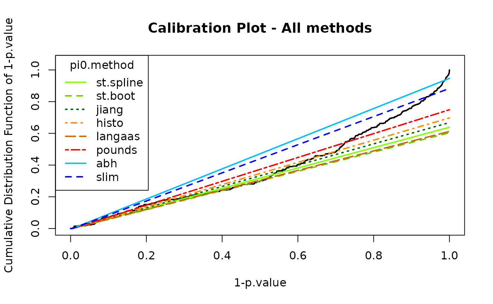
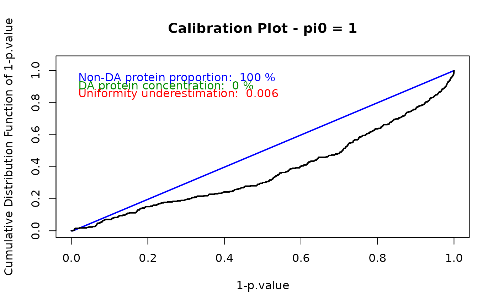

# Peptide workflow with DaparToolshed

## Introduction

`DaparToolshed` is a package for analyzing quantitative data from
label-free bottom-up proteomics experiments. It uses
`MultiAssayExperiment`, `SummarizedExperiment` and `QFeatures` data
structures (Gatto and Vanderaa (2025)).

Starting from a table of abundance values and associated metdata,
`DaparToolshed` proposes functions to build a complete statistical
analysis workflow up to the selection of differentially expressed
proteins in the contrasted conditions. `DaparToolshed` makes it possible
to import data at different levels: precursor, peptide or protein, each
requiring specific processing.

This vignette describes a complete precursor- or peptide-level workflow.

This package is used by the `Prostar2` package, which provides a
user-friendly graphical interfaces, so that programming skill is not
required to achieve the data analysis.

``` r
library(DaparToolshed)
```

## Import dataset

For testing purposes, the `DaparToolshedData` package is accompanied
with several example datasets.

The dataset used in this vignette is an extract from the `Exp1_R25_pept`
dataset in the `DaparToolshedData` package (Giai Gianetto et al.
(2016)). It comprises 500 peptides and 6 samples, divided into 2
conditions (“25fmol” and “10fmol”).

``` r
data.file <- system.file("extdata/data", "Exp1_R25_pept_500.txt", package="DaparToolshed")
data <- read.table(data.file, header=TRUE, sep="\t", as.is=TRUE, stringsAsFactors = FALSE)
  
sample.file <- system.file("extdata/data", "samples_Exp1_R25.txt", package="DaparToolshed")
sample <- read.table(sample.file, header=TRUE, sep="\t", as.is=TRUE, stringsAsFactors = FALSE)
```

`DaparToolshed` uses `MultiAssayExperiment`, `SummarizedExperiment` and
`QFeatures` data structures.

The function
[`createQFeatures()`](https://edyp-lab.github.io/DaparToolshed/reference/import-export-QFeatures.md)
allows for the importation of a given dataset to a `QFeatures` format.
The dataset can come from any tabulated-like file containing
quantitative data and metadata, accompanied by another dataframe for the
sample description. The `QFeatures` format allows you to keep track of
the various transformations made at each step.

For each peptide (or precursor) in each sample of the dataset, it is
possible to tag the evidence that links the abundance to the molecule
identified: for instance, if the abundance value is missing or imputed,
if the quantification-identification match result from a transfer
between samples or if there has been a fragmentation spectrum identified
in relation to the quantified elution profile, etc. If such metadata is
available, then the corresponding column indexes can be indicated in
`indexForMetacell`. This allows the information to be leveraged during
the workflow. The quantitative data do not need to be logged beforehand,
as setting `logData = TRUE` will yield automatic log-transform.
Similarly, with `force.na = TRUE`, any quantitative data with a null
value or a NaN will be converted to NA. It is necessary to specify the
column of the table where the mother proteins are indicated
(`'parentProtId'` parameter) as an adjacency matrix is created when the
function is executed. This matrix provides easy access to
peptide-protein relationships, including shared peptides, i.e., when the
same peptide belongs to several proteins. To run a peptidomics analysis
(i.e., peptides are analysed irrespective of their mother proteins), as
no peptide-to-protein aggregation is necessary, it is more suited to
rely on the same workflow as for protein-level analysis.

``` r
obj <- createQFeatures(data = data,
                       sample = sample,
                       indQData = 56:61,
                       keyId = "Sequence",
                       indexForMetacell = 43:48,
                       logData = TRUE,
                       force.na = TRUE,
                       typeDataset = "peptide",
                       parentProtId = "Protein_group_IDs",
                       analysis = "Pept_Data",
                       software = "maxquant",
                       name = "original")

obj
```

    ## An instance of class QFeatures (type: bulk) with 2 sets:
    ## 
    ##  [1] original: SummarizedExperiment with 500 rows and 6 columns 
    ##  [2] logAssay: SummarizedExperiment with 500 rows and 6 columns

The data obtained includes two assays: `original` and `logAssay`. The
original, non-logged data is contained in `original`, while the logged
data is in `logAssay`. This shows how the `QFeatures` format allows for
recording the state of the dataset after each step.

## Filtering

The first step in this workflow is peptide filtering. Not all peptides
in the dataset are relevant for analysis. Some may be contaminants, for
example, while others may have too many missing values to be taken into
account. This filtering can be done using information contained in
quantitative data tags (see above) or metadata, i.e., all the variables
from the original dataset that were not quantitative data and can be
accessed through the
[`SummarizedExperiment::rowData()`](https://rdrr.io/pkg/SummarizedExperiment/man/SummarizedExperiment-class.html)
function.

``` r
 #quantitative data tags
head(qMetacell(obj[[2]]))
```

    ##                           metacell_Intensity_C_R1 metacell_Intensity_C_R2
    ## AAAAQDEITGDGTTTVVCIVGEIIR     Quant. by direct id     Quant. by direct id
    ## AAADAISDIEIK                  Quant. by direct id     Quant. by direct id
    ## AAADAISDIEIKDSK                Quant. by recovery     Quant. by direct id
    ## AAAEEQAKR                             Missing POV     Quant. by direct id
    ## AAAEGVANIHIDEATGEMVSK         Quant. by direct id     Quant. by direct id
    ## AAAEYEKGEYETAISTINDAVEQGR     Quant. by direct id     Quant. by direct id
    ##                           metacell_Intensity_C_R3 metacell_Intensity_D_R1
    ## AAAAQDEITGDGTTTVVCIVGEIIR             Missing POV     Quant. by direct id
    ## AAADAISDIEIK                  Quant. by direct id     Quant. by direct id
    ## AAADAISDIEIKDSK               Quant. by direct id     Quant. by direct id
    ## AAAEEQAKR                             Missing POV             Missing MEC
    ## AAAEGVANIHIDEATGEMVSK          Quant. by recovery     Quant. by direct id
    ## AAAEYEKGEYETAISTINDAVEQGR     Quant. by direct id     Quant. by direct id
    ##                           metacell_Intensity_D_R2 metacell_Intensity_D_R3
    ## AAAAQDEITGDGTTTVVCIVGEIIR     Quant. by direct id     Quant. by direct id
    ## AAADAISDIEIK                  Quant. by direct id     Quant. by direct id
    ## AAADAISDIEIKDSK               Quant. by direct id     Quant. by direct id
    ## AAAEEQAKR                             Missing MEC             Missing MEC
    ## AAAEGVANIHIDEATGEMVSK         Quant. by direct id     Quant. by direct id
    ## AAAEYEKGEYETAISTINDAVEQGR     Quant. by direct id     Quant. by direct id

``` r
 #metadata
head(SummarizedExperiment::rowData(obj[[2]]), n = 3)
```

    ## DataFrame with 3 rows and 61 columns
    ##                                Sequence N_term_cleavage_window
    ##                             <character>            <character>
    ## AAAAQDEITGDGTTTVVCIVGEIIR AAAAQDEITG...          PTAVIIARAA...
    ## AAADAISDIEIK              AAADAISDIE...          MPKETPSKAA...
    ## AAADAISDIEIKDSK           AAADAISDIE...          MPKETPSKAA...
    ##                           C_term_cleavage_window Amino_acid_before
    ##                                      <character>       <character>
    ## AAAAQDEITGDGTTTVVCIVGEIIR          CIVGEIIRQA...                 R
    ## AAADAISDIEIK                       AISDIEIKDS...                 K
    ## AAADAISDIEIKDSK                    DIEIKDSKSN...                 K
    ##                           First_amino_acid Second_amino_acid
    ##                                <character>       <character>
    ## AAAAQDEITGDGTTTVVCIVGEIIR                A                 A
    ## AAADAISDIEIK                             A                 A
    ## AAADAISDIEIKDSK                          A                 A
    ##                           Second_last_amino_acid Last_amino_acid
    ##                                      <character>     <character>
    ## AAAAQDEITGDGTTTVVCIVGEIIR                      I               R
    ## AAADAISDIEIK                                   I               K
    ## AAADAISDIEIKDSK                                S               K
    ##                           Amino_acid_after   A_Count   R_Count   N_Count
    ##                                <character> <integer> <integer> <integer>
    ## AAAAQDEITGDGTTTVVCIVGEIIR                Q         4         1         0
    ## AAADAISDIEIK                             D         4         0         0
    ## AAADAISDIEIKDSK                          S         4         0         0
    ##                             D_Count   C_Count   Q_Count   E_Count   G_Count
    ##                           <integer> <integer> <integer> <integer> <integer>
    ## AAAAQDEITGDGTTTVVCIVGEIIR         2         1         1         2         3
    ## AAADAISDIEIK                      2         0         0         1         0
    ## AAADAISDIEIKDSK                   3         0         0         1         0
    ##                             H_Count   I_Count   L_Count   K_Count   M_Count
    ##                           <integer> <integer> <integer> <integer> <integer>
    ## AAAAQDEITGDGTTTVVCIVGEIIR         0         4         0         0         0
    ## AAADAISDIEIK                      0         3         0         1         0
    ## AAADAISDIEIKDSK                   0         3         0         2         0
    ##                             F_Count   P_Count   S_Count   T_Count   W_Count
    ##                           <integer> <integer> <integer> <integer> <integer>
    ## AAAAQDEITGDGTTTVVCIVGEIIR         0         0         0         4         0
    ## AAADAISDIEIK                      0         0         1         0         0
    ## AAADAISDIEIKDSK                   0         0         2         0         0
    ##                             Y_Count   V_Count   U_Count    Length
    ##                           <integer> <integer> <integer> <integer>
    ## AAAAQDEITGDGTTTVVCIVGEIIR         0         3         0        25
    ## AAADAISDIEIK                      0         0         0        12
    ## AAADAISDIEIKDSK                   0         0         0        15
    ##                           Missed_cleavages      Mass    Proteins
    ##                                  <integer> <numeric> <character>
    ## AAAAQDEITGDGTTTVVCIVGEIIR                0   2559.28      P39079
    ## AAADAISDIEIK                             0   1215.63      P09938
    ## AAADAISDIEIKDSK                          1   1545.79      P09938
    ##                           Leading_razor_protein Start_position End_position
    ##                                     <character>      <integer>    <integer>
    ## AAAAQDEITGDGTTTVVCIVGEIIR         sp|P39079|...             79          103
    ## AAADAISDIEIK                      sp|P09938|...              9           20
    ## AAADAISDIEIKDSK                   sp|P09938|...              9           23
    ##                           Unique_Groups Unique_Proteins     Charges        PEP
    ##                             <character>     <character> <character>  <numeric>
    ## AAAAQDEITGDGTTTVVCIVGEIIR           yes             yes         2;3 2.4684e-25
    ## AAADAISDIEIK                        yes             yes           2 1.8883e-04
    ## AAADAISDIEIKDSK                     yes             yes           3 2.7740e-06
    ##                               Score Experiment_C_R1 Experiment_C_R2
    ##                           <numeric>       <integer>       <integer>
    ## AAAAQDEITGDGTTTVVCIVGEIIR   114.150               1               2
    ## AAADAISDIEIK                 63.662               1               1
    ## AAADAISDIEIKDSK              93.237               1               1
    ##                           Experiment_C_R3 Experiment_D_R1 Experiment_D_R2
    ##                                 <integer>       <integer>       <integer>
    ## AAAAQDEITGDGTTTVVCIVGEIIR              NA               2               2
    ## AAADAISDIEIK                            1               1               1
    ## AAADAISDIEIKDSK                         1               1               1
    ##                           Experiment_D_R3 Intensity   Reverse
    ##                                 <integer> <numeric> <logical>
    ## AAAAQDEITGDGTTTVVCIVGEIIR               2 153490000        NA
    ## AAADAISDIEIK                            1 133190000        NA
    ## AAADAISDIEIKDSK                         1 136500000        NA
    ##                           Potential_contaminant        id Protein_group_IDs
    ##                                     <character> <integer>       <character>
    ## AAAAQDEITGDGTTTVVCIVGEIIR                               0              1210
    ## AAADAISDIEIK                                            1               254
    ## AAADAISDIEIKDSK                                         2               254
    ##                           Mod_peptide_IDs  Evidence_IDs     MS_MS_IDs
    ##                               <character>   <character>   <character>
    ## AAAAQDEITGDGTTTVVCIVGEIIR               0 0;1;2;3;4;... 0;1;2;3;4;...
    ## AAADAISDIEIK                            1 9;10;11;12... 8;9;10;11;...
    ## AAADAISDIEIKDSK                         2 15;16;17;1... 14;15;16;1...
    ##                           Best_MS_MS Oxidation_M_site_IDs MS_MS_Count
    ##                            <integer>          <character>   <integer>
    ## AAAAQDEITGDGTTTVVCIVGEIIR          6                                8
    ## AAADAISDIEIK                       8                                4
    ## AAADAISDIEIKDSK                   14                                5
    ##                                                               qMetacell
    ##                                                            <data.frame>
    ## AAAAQDEITGDGTTTVVCIVGEIIR Quant. by ...:Quant. by ...:Missing PO...:...
    ## AAADAISDIEIK              Quant. by ...:Quant. by ...:Quant. by ...:...
    ## AAADAISDIEIKDSK           Quant. by ...:Quant. by ...:Quant. by ...:...
    ##                           adjacencyMatrix
    ##                               <dgCMatrix>
    ## AAAAQDEITGDGTTTVVCIVGEIIR       1:0:0:...
    ## AAADAISDIEIK                    0:1:0:...
    ## AAADAISDIEIKDSK                 0:1:0:...

To apply a filter based on tags, the
[`FunctionFilter()`](https://edyp-lab.github.io/DaparToolshed/reference/QFeatures-filtering-oneSE.md)
function should be used. The functions `QFeatures::filterFeature()` and
[`QFeatures::VariableFilter()`](https://rformassspectrometry.github.io/QFeatures/reference/QFeatures-filtering.html)
can be used to create filters from metadata.

``` r
 #create filter to remove empty lines
filter_emptyline <- FunctionFilter("qMetacellWholeLine",
                                  cmd = 'delete',
                                  pattern = 'Missing MEC')
  
 #create filter to remove contaminant
filter_contaminant <- QFeatures::VariableFilter(field = "Potential_contaminant",
                                                value = "+",
                                                condition = "==",
                                                not = TRUE)
```

Doing so creates the filter but does not apply them to the data. All
created filters can be applied at once using the
[`filterFeaturesOneSE()`](https://edyp-lab.github.io/DaparToolshed/reference/QFeatures-filtering-oneSE.md)
function, which will perform filtering on the assay indicated by `i` and
create a new assay with the filtered peptides.

``` r
 #apply all filters and create new assay
obj <- filterFeaturesOneSE(object = obj,
                           i = length(obj),
                           name = "Filtered",
                           filters = list(filter_emptyline, filter_contaminant))
```

It is advised to remove proteins that no longer have an associated
peptide following this filtering from the adjacency matrix in order to
facilitate the subsequent aggregation step.

``` r
 #remove proteins with no associated peptides
X <- SummarizedExperiment::rowData(obj[[length(obj)]])$adjacencyMatrix
SummarizedExperiment::rowData(obj[[length(obj)]])$adjacencyMatrix <- X[, -which(Matrix::colSums(X) == 0)]

obj
```

    ## An instance of class QFeatures (type: bulk) with 3 sets:
    ## 
    ##  [1] original: SummarizedExperiment with 500 rows and 6 columns 
    ##  [2] logAssay: SummarizedExperiment with 500 rows and 6 columns 
    ##  [3] Filtered: SummarizedExperiment with 480 rows and 6 columns

## Normalization

The normalization step reduces biases introduced at any preliminary
stage, as to make samples more comparable. Though not a full batch
effect correction method (which can be required depending on the
experimental design), it can limit some simple batch effects. During
this step, peptide abundances are essentially rescaled between samples
of the same conditions or of all conditions.

Several algorithms are implemented in `DaparToolshed` and the list of
available methods can be accessed by using
[`normalizeMethods()`](https://edyp-lab.github.io/DaparToolshed/reference/normalization_methods.md)
:

``` r
 #list of available methods
normalizeMethods()
```

    ## [1] "GlobalQuantileAlignment" "SumByColumns"           
    ## [3] "QuantileCentering"       "MeanCentering"          
    ## [5] "LOESS"                   "vsn"

The methods proposed acts as described below:

- `GlobalQuantileAlignment` : Aligns the quantiles of intensity
  distributions across all samples. (This method should be used
  cautiously, as it imposes a high-impact normalization. Broadly
  speaking, the abundances are replaced by their order statistics).
- `SumByColumns` : Normalizes each abundance value by the total
  abundance of its corresponding sample. Un-logged intensities are used
  for processing. This method assumes the total amount of biological
  material is equal in all the samples .
- `QuantileCentering` : Aligns the intensity distributions to a specific
  quantile, e.g., the median or a lower quantile, either across all
  samples or within each condition.
- `MeanCentering` : Aligns the intensity distributions to their means,
  either across all samples or within each condition. Optionally, unit
  variance can be enforced.
- `LOESS` : Applies a cyclic LOESS normalization, either across all
  samples or within each condition. The intensity values are normalized
  by means of a local regression model of the difference of intensities
  as function of the median intensity value (Cleveland (1979)) (see
  Smyth (2005) for implementation details).
- `vsn` : Applies the Variance Stabilization Normalization method,
  either across all samples or within each condition (Huber et al.
  (2002)).

The
[`normalizeFunction()`](https://edyp-lab.github.io/DaparToolshed/reference/normalizeFunction.md)
function allows you to normalize data using any of the methods described
above and create a new assay with normalized data. The parameters to be
defined depend on the chosen method. The `type` argument allows to
indicate whether the method is applied to the entire dataset at once
(`"overall"`) or whether each condition is normalized independently
(`"within conditions"`).

``` r
obj <- normalizeFunction(obj,
                         method = "MeanCentering",
                         scaling = TRUE,
                         type = "overall")

obj
```

    ## An instance of class QFeatures (type: bulk) with 4 sets:
    ## 
    ##  [1] original: SummarizedExperiment with 500 rows and 6 columns 
    ##  [2] logAssay: SummarizedExperiment with 500 rows and 6 columns 
    ##  [3] Filtered: SummarizedExperiment with 480 rows and 6 columns 
    ##  [4] Normalization: SummarizedExperiment with 480 rows and 6 columns

The
[`compareNormalizationD_HC()`](https://edyp-lab.github.io/DaparToolshed/reference/compareNormalizationD_HC.md)
function provides a way to visually compare the quantitative data before
and after normalization. This plot shows the influence of the
normalization method.

``` r
obj1 <- obj[[length(obj)]]
obj2 <- obj[[length(obj)-1]]
protId <- DaparToolshed::idcol(obj1)

.n <- floor(0.02 * nrow(obj1))
.subset <- seq(nrow(obj1))

compareNormalizationD_HC(
  qDataBefore = SummarizedExperiment::assay(obj1),
  qDataAfter = SummarizedExperiment::assay(obj2),
  keyId = SummarizedExperiment::rowData(obj1)[, protId],
  conds = DaparToolshed::design.qf(obj)$Condition,
  n = .n,
  subset.view = .subset
)
```

## Imputation

It is common to face a significant number of missing values. To overcome
this problem, it is often necessary to resort to imputation. However, it
is important to note that data imputation amount to creating
experimental measurements out of thin air (and of a bit of mathematics
too). It is thus recommended to avoid imputation whenever possible.
However, most algorithms required subsequently cannot deal with missing
values, and the few that claim to be robust to missing values either
relies on implicit or explicit imputation, which makes them no better.

First, it is interesting to look at the quantity and distribution of
missing values. The
[`metacellPerLinesHisto_HC()`](https://edyp-lab.github.io/DaparToolshed/reference/metacell-plots.md)
and
[`metacellPerLinesHistoPerCondition_HC()`](https://edyp-lab.github.io/DaparToolshed/reference/metacell-plots.md)
functions give access to the number of rows containing a given number of
missing values, respectively for all samples and within each condition.
These functions use the quantitative data tags described above.

``` r
pal <- unique(GetColorsForConditions(design.qf(obj)$Condition))
pattern <- c("Missing MEC", "Missing POV")
grp <- design.qf(obj)$Condition

 #number of line with different amount of NA
metacellPerLinesHisto_HC(obj[[length(obj)]], group = grp, pattern = pattern)
```

``` r
 #number of line with different amount of NA per condition
metacellPerLinesHistoPerCondition_HC(obj[[length(obj)]], group = grp, pattern = pattern)
```

The
[`hc_mvTypePlot2()`](https://edyp-lab.github.io/DaparToolshed/reference/metacell-plots.md)
function displays density plots showing the distribution of partially
observed values for each condition. The x-axis corresponds to the mean
intensity of a peptide in a condition, while the y-axis indicates the
number of observed values for that peptide under the same condition.

It can be observed that the distribution tends to shift towards higher
values when fewer missing values are present. This is a sign that at
least some of the missing values originate from peptides that are below
the lower limit of the mass spectrometer.

``` r
hc_mvTypePlot2(obj[[length(obj)]], group = grp, pattern = pattern, pal = pal)
```

Numerous imputation methods exist. Here, data imputation is performed
using the
[`wrapper.pirat()`](https://edyp-lab.github.io/DaparToolshed/reference/wrapper.pirat.md)
function, which is a wrapper for the `Pirat` method. `Pirat` is an
imputation method that uses a penalized maximum likelihood strategy and
accounts for sibling peptide correlations (Etourneau et al. (2024)). It
does not require any parameter tuning. For more information on this
method, see the
[Pirat](https://www.bioconductor.org/packages/release/bioc/html/Pirat.html)
package.

``` r
obj <- wrapper.pirat(data = obj,
                     adjmat = SummarizedExperiment::rowData(obj[[length(obj)]])$adjacencyMatrix,
                     extension = "base")
```

    ## Installing pyenv ...
    ## Done! pyenv has been installed to '/home/runner/.local/share/r-reticulate/pyenv/bin/pyenv'.
    ## Using Python: /home/runner/.pyenv/versions/3.10.19/bin/python3.10
    ## Creating virtual environment '/home/runner/.cache/R/basilisk/1.22.0/Pirat/1.4.4/envPirat' ...

    ## Done!
    ## Installing packages: pip, wheel, setuptools

    ## Installing packages: 'torch==2.0.0', 'numpy==1.24'

    ## Virtual environment '/home/runner/.cache/R/basilisk/1.22.0/Pirat/1.4.4/envPirat' successfully created.
    ## 
    ## Call:
    ## stats::lm(formula = log(probs) ~ m_ab_sorted[seq(length(probs))])
    ## 
    ## Residuals:
    ##     Min      1Q  Median      3Q     Max 
    ## -1.7621 -0.4354  0.1148  0.4852  1.8991 
    ## 
    ## Coefficients:
    ##                                 Estimate Std. Error t value Pr(>|t|)    
    ## (Intercept)                     24.07420    1.35105   17.82   <2e-16 ***
    ## m_ab_sorted[seq(length(probs))] -1.07882    0.05536  -19.49   <2e-16 ***
    ## ---
    ## Signif. codes:  0 '***' 0.001 '**' 0.01 '*' 0.05 '.' 0.1 ' ' 1
    ## 
    ## Residual standard error: 0.6937 on 368 degrees of freedom
    ## Multiple R-squared:  0.5079, Adjusted R-squared:  0.5066 
    ## F-statistic: 379.8 on 1 and 368 DF,  p-value: < 2.2e-16

``` r
obj
```

    ## An instance of class QFeatures (type: bulk) with 5 sets:
    ## 
    ##  [1] original: SummarizedExperiment with 500 rows and 6 columns 
    ##  [2] logAssay: SummarizedExperiment with 500 rows and 6 columns 
    ##  [3] Filtered: SummarizedExperiment with 480 rows and 6 columns 
    ##  [4] Normalization: SummarizedExperiment with 480 rows and 6 columns 
    ##  [5] Imputation: SummarizedExperiment with 480 rows and 6 columns

## Aggregation

The next step is to aggregate the peptide-level data into protein-level
data. For optimal results in the subsequent differential analysis, it is
important to aggregate only after imputation.

Beforehand, it may be useful to look at the dataset in more details and
to choose the most appropriate aggregation method accordingly. The
[`getProteinsStats()`](https://edyp-lab.github.io/DaparToolshed/reference/DaparToolshed-aggregate.md)
function displays various information about peptides and associated
proteins from the adjacency matrix.

``` r
X <- SummarizedExperiment::rowData(obj[[length(obj)]])$adjacencyMatrix
info_pept <- getProteinsStats(X)

cat("Total number of peptides : ", info_pept$nbPeptides, "\n",
    "Number of specific peptides : ", info_pept$nbSpecificPeptides, "\n",
    "Number of shared peptides : ", info_pept$nbSharedPeptides, "\n")
```

    ## Total number of peptides :  480 
    ##  Number of specific peptides :  464 
    ##  Number of shared peptides :  16

``` r
cat("Total number of proteins : ", info_pept$nbProt, "\n",
    "Number of protein with only specific peptides : ", length(info_pept$protOnlyUniquePep), "\n",
    "Number of protein with only shared peptides : ", length(info_pept$protOnlySharedPep), "\n",
    "Number of protein with both : ", length(info_pept$protMixPep), "\n")
```

    ## Total number of proteins :  378 
    ##  Number of protein with only specific peptides :  350 
    ##  Number of protein with only shared peptides :  21 
    ##  Number of protein with both :  7

There are predominantly specific peptides, but several proteins contain
shared peptides. The question of how to manage these shared peptides may
arise. Contrarily to most aggregation functions,
[`RunAggregation()`](https://edyp-lab.github.io/DaparToolshed/reference/DaparToolshed-aggregate.md)
allows shared peptides to be taken into account in various ways –to be
specified using the `includeSharedPeptides` argument. First, they can be
handled as specific peptides (`Yes_As_Specific`), in which case they
will be duplicated for each protein they belong to. Second, they can
have their intensity redistributed proportionally across the different
proteins (`Yes_Iterative_Redistribution` or
`Yes_Simple_Redistribution`). Finally, shared peptides can be ignored
(`No`). If `Yes_Iterative_Redistribution`, `Yes_Simple_Redistribution`
or `No` is chosen, proteins containing only shared peptides will have no
associated value. In addition, there is the choice of aggregation
function, used for quantitative feature aggregation, with `operator`.
This can be either `Sum`, `Mean`, `Median`, `medianPolish` or
`robustSummary`.

``` r
obj <- RunAggregation(obj,
                      adjMatrix = 'adjacencyMatrix',
                      includeSharedPeptides = 'Yes_Iterative_Redistribution',
                      operator = 'Mean',
                      considerPeptides = 'allPeptides',
                      ponderation = "Global",
                      max_iter = 500
                      )

obj
```

    ## An instance of class QFeatures (type: bulk) with 6 sets:
    ## 
    ##  [1] original: SummarizedExperiment with 500 rows and 6 columns 
    ##  [2] logAssay: SummarizedExperiment with 500 rows and 6 columns 
    ##  [3] Filtered: SummarizedExperiment with 480 rows and 6 columns 
    ##  [4] Normalization: SummarizedExperiment with 480 rows and 6 columns 
    ##  [5] Imputation: SummarizedExperiment with 480 rows and 6 columns 
    ##  [6] aggregated: SummarizedExperiment with 378 rows and 6 columns

After aggregation, it can be seen that there are still some missing
values. These come from proteins that only have shared peptides, which
have been left out using this method, as explained above.

``` r
summary(SummarizedExperiment::assay(obj[["aggregated"]]))
```

    ##  Intensity_C_R1  Intensity_C_R2  Intensity_C_R3  Intensity_D_R1 
    ##  Min.   :22.24   Min.   :21.83   Min.   :22.54   Min.   :22.24  
    ##  1st Qu.:24.00   1st Qu.:24.00   1st Qu.:24.03   1st Qu.:24.00  
    ##  Median :24.61   Median :24.58   Median :24.56   Median :24.58  
    ##  Mean   :24.66   Mean   :24.67   Mean   :24.68   Mean   :24.68  
    ##  3rd Qu.:25.24   3rd Qu.:25.25   3rd Qu.:25.25   3rd Qu.:25.21  
    ##  Max.   :27.70   Max.   :27.70   Max.   :27.78   Max.   :27.71  
    ##  NA's   :21      NA's   :21      NA's   :21      NA's   :21     
    ##  Intensity_D_R2  Intensity_D_R3 
    ##  Min.   :22.24   Min.   :21.78  
    ##  1st Qu.:24.03   1st Qu.:24.04  
    ##  Median :24.61   Median :24.58  
    ##  Mean   :24.70   Mean   :24.68  
    ##  3rd Qu.:25.23   3rd Qu.:25.22  
    ##  Max.   :27.72   Max.   :27.68  
    ##  NA's   :21      NA's   :21

A new filter can thus be applied to these protein-level data to remove
them.

``` r
 #apply the filter to remove empty lines created
obj <- filterFeaturesOneSE(object = obj,
                           i = length(obj),
                           name = "FilterProt",
                           filters = list(filter_emptyline))

obj
```

    ## An instance of class QFeatures (type: bulk) with 7 sets:
    ## 
    ##  [1] original: SummarizedExperiment with 500 rows and 6 columns 
    ##  [2] logAssay: SummarizedExperiment with 500 rows and 6 columns 
    ##  [3] Filtered: SummarizedExperiment with 480 rows and 6 columns 
    ##  [4] Normalization: SummarizedExperiment with 480 rows and 6 columns 
    ##  [5] Imputation: SummarizedExperiment with 480 rows and 6 columns 
    ##  [6] aggregated: SummarizedExperiment with 378 rows and 6 columns 
    ##  [7] FilterProt: SummarizedExperiment with 357 rows and 6 columns

## Differential Analysis

Differential protein expression analysis compares the relative abundance
of the same protein between two conditions. The comparison between two
conditions results in what is called a contrast, for example “A vs. B.”
The dataset used here contains only two conditions, hence there is only
one contrast to be considered.

For additional advice on this step, see Wieczorek, Giai Gianetto, and
Burger (2019).

### Hypothesis test

The first step in differential analysis is null hypothesis testing,
which provides a p-value for each protein. These p-values will then
enable the selection of the proteins which are significantly
differentially abundant between the conditions contrasted. Limma can be
used to do so with the
[`limmaCompleteTest()`](https://edyp-lab.github.io/DaparToolshed/reference/limmaCompleteTest.md)
function. This function returns a list of p-values and logarithmized
fold-change (logFC) for each contrast.

``` r
res_pval_FC <- limmaCompleteTest(SummarizedExperiment::assay(obj[[length(obj)]]), 
                                 design.qf(obj), 
                                 comp.type = "OnevsOne")

str(res_pval_FC)
```

    ## List of 2
    ##  $ logFC  :'data.frame': 357 obs. of  1 variable:
    ##   ..$ 25fmol_vs_10fmol_logFC: num [1:357] -0.06004 -0.00635 0.00193 0.07484 -0.02928 ...
    ##  $ P_Value:'data.frame': 357 obs. of  1 variable:
    ##   ..$ 25fmol_vs_10fmol_pval: num [1:357] 0.547 0.918 0.897 0.283 0.241 ...

### Fold-change

The next step is to define the logFC threshold. This threshold should be
set relatively low to avoid discarding too many proteins, as the
subsequent False Discovery Rate (FDR) control is more reliable when
applied to a sufficiently large protein set. Because FDR is a
percentage-based measure, it becomes unstable when too few proteins are
retained.

The plot obtained through
[`hc_logFC_DensityPlot()`](https://edyp-lab.github.io/DaparToolshed/reference/hc_logFC_DensityPlot.md)
can help tuning the logFC threshold. It shows the distribution of logFCs
and indicates the percentage of discarded proteins based on the
specified threshold. Here, with a threshold of 0.04, almost 39% of
proteins are discarded.

``` r
 #logFC threshold
Foldchange_thlogFC <- 0.04
        
hc_logFC_DensityPlot(
  df_logFC = as.data.frame(res_pval_FC$logFC),
  th_logFC = Foldchange_thlogFC
  )
```

### Push p-value

Some protein abundances may result from peptides that have been largely
imputed. When imputation occurs in both conditions, it is likely that
these proteins lack reliability and should therefore not be considered
differentially abundant, even if their p-values appear significant. More
generally, proteins with excellent p-values but a high proportion of
imputed petpide’s intensities should be treated with caution, as their
quantification is unreliable.

To prevent these proteins from being falsely considered differentially
abundant, they can be discarded by forcing their p-value to 1. This can
be done using the
[`pushpvalue()`](https://edyp-lab.github.io/DaparToolshed/reference/pushpvalue.md)
function. The settings are the same as when applying a filter using
quantitative data tags. By default, the
[`pushpvalue()`](https://edyp-lab.github.io/DaparToolshed/reference/pushpvalue.md)
function assigns a value sligthly above 1 to be able to identify
p-values set to 1 by this step versus those originally equal to 1.

With 6 samples divided into 2 conditions, proteins with only a single
observed value can easily be discarded. Even if their p-values appear
promising, these proteins may not be informative for the analysis.

``` r
pval <- unlist(res_pval_FC$P_Value)

 #push p-values for proteins with more than 60% of values derived from imputation
pval <- pushpvalue(obj,
                   pval,
                   scope = "WholeMatrix",
                   pattern = c("Imputed POV", "Imputed MEC"),
                   percent = FALSE,
                   threshold = 5,
                   operator = ">=")

cat("Number of pushed p-values : ", length(which(pval > 1)), "\n")
```

    ## Number of pushed p-values :  19

### P-value calibration

At this point, it is possible to check the validity of the p-values and
to tune the FDR control method accordingly.

To do so, we can use a calibration plot to verify that the distribution
of p-values is compliant with FDR computation theory. Taking into
account a supposedly known proportion of non-differentially abundant
proteins, denoted π0, a calibration plot should display a curve that
follows a straight line of slope π0, until a sharp increase on the right
hand side. This increase indicates a good discrimination between
differentially abundant proteins and those that are not. If the curve is
above the straight line before this increase, it is, on the contrary, a
sign of poor calibration. More information about p-value calibration can
be found in the
[cp4p](https://cran.r-project.org/web/packages/cp4p/index.html) package
and Giai Gianetto et al. (2016).

The
[`wrapperCalibrationPlot()`](https://edyp-lab.github.io/DaparToolshed/reference/wrapperCalibrationPlot.md)
function is a wrapper using functions from the `cp4p` package to create
calibration plots (Giai Gianetto et al. (2016)). Several methods for
estimating π0 are implemented in this package. The `pi0Method` argument
allows selecting a specific method, displaying all methods on the same
plot using `"ALL"`, or specifying any numerical value of π0 between 0
and 1. The π0 value of each calibration method can be accessed from the
created object via `pi0`.

Pushed p-values should not be taken into account during calibration in
order to avoid skewing the p-value distribution.

``` r
 #remove pushed p-values
pushedpval_ind <- which(pval > 1)
pval_nopush <- pval[-pushedpval_ind]

 #calibration plot with all methods 
calibration_all <- wrapperCalibrationPlot(vPVal = pval_nopush, 
                                          pi0Method  = "ALL")
```



``` r
calibration_all$pi0
```

    ##   pi0.Storey.Spline pi0.Storey.Boot pi0.Jiang pi0.Histo pi0.Langaas pi0.Pounds
    ## 1         0.6383234       0.6035503 0.6679852 0.6973795   0.6122122  0.7489547
    ##     pi0.ABH  pi0.SLIM
    ## 1 0.9467456 0.8832706

In some situations, the curve may not show a sufficiently sharp
increase, or the entire distribution may be ill-calibrated. In some
cases, the issue may stem from earlier preprocessing steps.

If the increase is not strong enough but remains acceptable, it is
possible to compensate for poor calibration by overestimating π0.

In the worst case, the Benjamini–Hochberg option can always be selected.
This correspond to the safer case of π0=1, which is not shown on the
previous plot as it always corresponds to a diagonal line.

The
[`histPValue_HC()`](https://edyp-lab.github.io/DaparToolshed/reference/histPValue_HC.md)
function provides an alternative graphical representation of the
distribution of p-values and π0, while conveying the same information.
It is more intuitive to understand, but more difficult to use it to
precisely assess the calibration quality. Both graphics are thus
complementary.

``` r
 #chosen pi0
pi0 <- 1

 #calibration plot with chosen method
wrapperCalibrationPlot(vPVal = pval_nopush, 
                       pi0Method  = pi0)
```



    ## $pi0
    ## [1] 1
    ## 
    ## $h1.concentration
    ## [1] 0
    ## 
    ## $unif.under
    ## [1] 0.006418716

``` r
 #histogram of p-values density
histPValue_HC(pval_nopush,
              bins = 50,
              pi0 = pi0
)
```

The
[`diffAnaComputeAdjustedPValues()`](https://edyp-lab.github.io/DaparToolshed/reference/diffAnaComputeAdjustedPValues.md)
function returns the adjusted p-values corresponding to the p-values of
the differential analysis. Proteins with a logFC below the previously
defined threshold are taken into account when calculating adjusted
p-values. However, their p-value is pushed to 1, as they are considered
‘discarded’.

``` r
 #push to 1 proteins with logFC under threshold
pval_pushfc <- pval
pval_logfc_inf_ind <- which(abs(res_pval_FC$logFC) < Foldchange_thlogFC)
pval_logfc_inf_ind <- setdiff(pval_logfc_inf_ind, pushedpval_ind)
pval_pushfc[pval_logfc_inf_ind] <- 1
 #remove pushed p-values
pval_pushfc <- pval_pushfc[-pushedpval_ind]


 #calculate adjusted p-values
adjusted_pvalues <- diffAnaComputeAdjustedPValues(
  pval_pushfc,
  pi0)
```

    ## Procedure of Benjamini-Hochberg is used. pi0 is fixed to 1.

``` r
adjusted_pvalues_comp <- unlist(res_pval_FC$P_Value)
adjusted_pvalues_comp[-pushedpval_ind] <- adjusted_pvalues
```

### FDR control

The final step is FDR control, which aims to limit the proportion of
false positives among proteins identified as differentially abundant.

A p-value threshold is first defined to select the proteins deemed
differentially abundant. Any protein with a p-value below this threshold
is retained. The associated FDR level is then provided, based on the
p-value adjustment procedure.

The expected number of false discoveries can be estimated by multiplying
the FDR with the number significant proteins. Because the FDR is a
percentage-based measure, it becomes difficult to interpret when the
expected number of falsely discovered proteins falls below 1, as it
corresponds to strictly less than one expected false discovery. This is
likely to happen in small datasets. However, an FDR that becomes
meaningless does not invalidate the proteomics experiment itself. It
only means that the FDR should be used cautiously.

``` r
 #define p-value threshold
pval_threshold <- 0.01
FDRcontrol_thpval <- -log10(pval_threshold)

 #get FDR
pval[pushedpval_ind] <- 1
logpval <- -log10(pval)
logpval_thpval_ind <- which(logpval >= FDRcontrol_thpval)
logpval_thpval_ind <- setdiff(logpval_thpval_ind, pval_logfc_inf_ind)
fdr <- diffAnaComputeFDR(adjusted_pvalues_comp[logpval_thpval_ind])

 #determine differentially abundant proteins
isDifferential <- is.differential(pvalue = pval,
                                 logFC = res_pval_FC$logFC,
                                 thpvalue = FDRcontrol_thpval,
                                 thlogFC = Foldchange_thlogFC)
NbSignificant <- length(which(isDifferential == 1))

cat("pvalue threshold : ", pval_threshold, "\n",
    "logpvalue threshold : ", FDRcontrol_thpval, "\n",
    "FDR : ", round(100*fdr, 2), "%\n",
    "Number significant proteins : ", NbSignificant, "\n",
    "Number of expected false discovery : ", fdr*NbSignificant, "\n")
```

    ## pvalue threshold :  0.01 
    ##  logpvalue threshold :  2 
    ##  FDR :  16.75 %
    ##  Number significant proteins :  19 
    ##  Number of expected false discovery :  3.18342

The
[`diffAnaVolcanoplot_rCharts()`](https://edyp-lab.github.io/DaparToolshed/reference/diffAnaVolcanoplot_rCharts.md)
function provides a volcano plot to visualize the differentially
abundant proteins according to the logFC and p-value thresholds. It
requires a `data.frame` containing the logFC, log-transformed p-values,
protein index, and any additional information to be displayed in the
tooltip when hovering over a point in the plot. The FDR threshold
corresponds to the horizontal dashed line, and the logFC threshold to
the vertical dashed line.

``` r
 #create dataframe for volcano plot
df <- data.frame(
  x = unlist(res_pval_FC$logFC),
  y = logpval,
  index = as.character(rownames(obj[[length(obj)]]))
  )
tooltip <- "proteinId"
df <- cbind(df, SummarizedExperiment::rowData(obj[[length(obj)]])[, tooltip, drop = F])
colnames(df) <- gsub(".", "_", colnames(df), fixed = TRUE)
if (ncol(df) > 3) {
  colnames(df)[4:ncol(df)] <- paste0("tooltip_",
                                      colnames(df)[4:ncol(df)])
}
cond <- unique(design.qf(obj)$Condition)

 #volcano plot
diffAnaVolcanoplot_rCharts(
  df,
  th_pval = FDRcontrol_thpval,
  th_logfc = Foldchange_thlogFC,
  conditions = cond
)
```

A new assay can be created to keep all values of interest, such as all
p-values, logFCs, or the differential or non-differential status of each
protein. This allows you to keep this data organized in a single object
and reuse it later if necessary for further processing or visualization.

``` r
 #create new assay with all values of interest
obj <- QFeatures::addAssay(obj, obj[[length(obj)]], 'DifferentialAnalysis')
SummarizedExperiment::rowData(obj[[length(obj)]])$pval <- unlist(res_pval_FC$P_Value)
SummarizedExperiment::rowData(obj[[length(obj)]])$logpval <- logpval
SummarizedExperiment::rowData(obj[[length(obj)]])$logFC <- unlist(res_pval_FC$logFC)

SummarizedExperiment::rowData(obj[[length(obj)]])$adjusted_pval <- adjusted_pvalues_comp

SummarizedExperiment::rowData(obj[[length(obj)]])$isDifferential <- isDifferential

obj
```

    ## An instance of class QFeatures (type: bulk) with 8 sets:
    ## 
    ##  [1] original: SummarizedExperiment with 500 rows and 6 columns 
    ##  [2] logAssay: SummarizedExperiment with 500 rows and 6 columns 
    ##  [3] Filtered: SummarizedExperiment with 480 rows and 6 columns 
    ##  ...
    ##  [6] aggregated: SummarizedExperiment with 378 rows and 6 columns 
    ##  [7] FilterProt: SummarizedExperiment with 357 rows and 6 columns 
    ##  [8] DifferentialAnalysis: SummarizedExperiment with 357 rows and 6 columns

## Session information

    ## R version 4.5.2 (2025-10-31)
    ## Platform: x86_64-pc-linux-gnu
    ## Running under: Ubuntu 24.04.3 LTS
    ## 
    ## Matrix products: default
    ## BLAS:   /usr/lib/x86_64-linux-gnu/openblas-pthread/libblas.so.3 
    ## LAPACK: /usr/lib/x86_64-linux-gnu/openblas-pthread/libopenblasp-r0.3.26.so;  LAPACK version 3.12.0
    ## 
    ## locale:
    ##  [1] LC_CTYPE=C.UTF-8       LC_NUMERIC=C           LC_TIME=C.UTF-8       
    ##  [4] LC_COLLATE=C.UTF-8     LC_MONETARY=C.UTF-8    LC_MESSAGES=C.UTF-8   
    ##  [7] LC_PAPER=C.UTF-8       LC_NAME=C              LC_ADDRESS=C          
    ## [10] LC_TELEPHONE=C         LC_MEASUREMENT=C.UTF-8 LC_IDENTIFICATION=C   
    ## 
    ## time zone: UTC
    ## tzcode source: system (glibc)
    ## 
    ## attached base packages:
    ## [1] stats     graphics  grDevices utils     datasets  methods   base     
    ## 
    ## other attached packages:
    ## [1] DaparToolshed_0.99.24 BiocStyle_2.38.0     
    ## 
    ## loaded via a namespace (and not attached):
    ##   [1] fs_1.6.6                    ProtGenerics_1.42.0        
    ##   [3] matrixStats_1.5.0           bitops_1.0-9               
    ##   [5] lubridate_1.9.4             RColorBrewer_1.1-3         
    ##   [7] doParallel_1.0.17           tools_4.5.2                
    ##   [9] MSnbase_2.36.0              backports_1.5.0            
    ##  [11] R6_2.6.1                    DT_0.34.0                  
    ##  [13] sm_2.2-6.0                  lazyeval_0.2.2             
    ##  [15] MESS_0.6.0                  withr_3.0.2                
    ##  [17] prettyunits_1.2.0           gridExtra_2.3              
    ##  [19] preprocessCore_1.72.0       cli_3.6.5                  
    ##  [21] shinyEffects_0.2.0          Biobase_2.70.0             
    ##  [23] textshaping_1.0.4           factoextra_1.0.7           
    ##  [25] Pirat_1.4.4                 flashClust_1.01-2          
    ##  [27] shinyjs_2.1.1               sandwich_3.1-1             
    ##  [29] nipals_1.0                  sass_0.4.10                
    ##  [31] bs4Dash_2.3.5               mvtnorm_1.3-3              
    ##  [33] S7_0.2.1                    ggridges_0.5.7             
    ##  [35] pkgdown_2.2.0               systemfonts_1.3.1          
    ##  [37] vioplot_0.5.1               MetaboCoreUtils_1.18.1     
    ##  [39] labelled_2.16.0             invgamma_1.2               
    ##  [41] limma_3.66.0                TTR_0.24.4                 
    ##  [43] impute_1.84.0               visNetwork_2.1.4           
    ##  [45] generics_0.1.4              gtools_3.9.5               
    ##  [47] dplyr_1.1.4                 zip_2.3.3                  
    ##  [49] dendextend_1.19.1           leaps_3.2                  
    ##  [51] Matrix_1.7-4                MALDIquant_1.22.3          
    ##  [53] S4Vectors_0.48.0            clipr_0.8.0                
    ##  [55] abind_1.4-8                 lifecycle_1.0.5            
    ##  [57] scatterplot3d_0.3-44        multcomp_1.4-29            
    ##  [59] yaml_2.3.12                 SummarizedExperiment_1.40.0
    ##  [61] qvalue_2.42.0               gplots_3.3.0               
    ##  [63] SparseArray_1.10.8          grid_4.5.2                 
    ##  [65] promises_1.5.0              crayon_1.5.3               
    ##  [67] PSMatch_1.14.0              dir.expiry_1.18.0          
    ##  [69] lattice_0.22-7              haven_2.5.5                
    ##  [71] MagellanNTK_0.99.23         mzR_2.44.0                 
    ##  [73] pillar_1.11.1               knitr_1.51                 
    ##  [75] GenomicRanges_1.62.1        estimability_1.5.1         
    ##  [77] codetools_0.2-20            glue_1.8.0                 
    ##  [79] ggiraph_0.9.3               fontLiberation_0.1.0       
    ##  [81] pcaMethods_2.2.0            data.table_1.18.2.1        
    ##  [83] MultiAssayExperiment_1.36.1 vctrs_0.7.1                
    ##  [85] png_0.1-8                   gtable_0.3.6               
    ##  [87] assertthat_0.2.1            cachem_1.1.0               
    ##  [89] xfun_0.56                   openxlsx_4.2.8.1           
    ##  [91] S4Arrays_1.10.1             mime_0.13                  
    ##  [93] tidyverse_2.0.0             Seqinfo_1.0.0              
    ##  [95] survival_3.8-3              ncdf4_1.24                 
    ##  [97] iterators_1.0.14            statmod_1.5.1              
    ##  [99] TH.data_1.1-5               xts_0.14.1                 
    ## [101] fontquiver_0.2.1            progress_1.2.3             
    ## [103] filelock_1.0.3              bslib_0.10.0               
    ## [105] affyio_1.80.0               KernSmooth_2.23-26         
    ## [107] otel_0.2.0                  BiocGenerics_0.56.0        
    ## [109] shinyjqui_0.4.1             tidyselect_1.2.1           
    ## [111] emmeans_2.0.1               compiler_4.5.2             
    ## [113] curl_7.0.0                  waiter_0.2.5.1             
    ## [115] graph_1.88.1                desc_1.4.3                 
    ## [117] fontBitstreamVera_0.1.1     DelayedArray_0.36.0        
    ## [119] bookdown_0.46               mosaicCore_0.9.5           
    ## [121] scales_1.4.0                caTools_1.18.3             
    ## [123] affy_1.88.0                 multcompView_0.1-10        
    ## [125] rappdirs_0.3.4              stringr_1.6.0              
    ## [127] digest_0.6.39               ggformula_1.0.1            
    ## [129] shinyBS_0.63.0              rmarkdown_2.30             
    ## [131] basilisk_1.22.0             XVector_0.50.0             
    ## [133] htmltools_0.5.9             pkgconfig_2.0.3            
    ## [135] highcharter_0.9.4           geeM_0.10.1                
    ## [137] MatrixGenerics_1.22.0       FactoMineR_2.13            
    ## [139] fastmap_1.2.0               rlang_1.1.7                
    ## [141] htmlwidgets_1.6.4           quantmod_0.4.28            
    ## [143] shiny_1.12.1                farver_2.1.2               
    ## [145] jquerylib_0.1.4             zoo_1.8-15                 
    ## [147] jsonlite_2.0.0              BiocParallel_1.44.0        
    ## [149] mzID_1.48.0                 rlist_0.4.6.2              
    ## [151] magrittr_2.0.4              Rcpp_1.1.1                 
    ## [153] geepack_1.3.13              viridis_0.6.5              
    ## [155] gdtools_0.4.4               MsCoreUtils_1.22.1         
    ## [157] reticulate_1.44.1           vsn_3.78.1                 
    ## [159] stringi_1.8.7               MASS_7.3-65                
    ## [161] plyr_1.8.9                  shinyFiles_0.9.3           
    ## [163] parallel_4.5.2              ggrepel_0.9.6              
    ## [165] forcats_1.0.1               splines_4.5.2              
    ## [167] multtest_2.66.0             hms_1.1.4                  
    ## [169] Spectra_1.20.1              igraph_2.2.1               
    ## [171] QFeatures_1.20.0            reshape2_1.4.5             
    ## [173] stats4_4.5.2                XML_3.99-0.20              
    ## [175] evaluate_1.0.5              cp4p_0.3.6                 
    ## [177] BiocManager_1.30.27         foreach_1.5.2              
    ## [179] httpuv_1.6.16               tidyr_1.3.2                
    ## [181] purrr_1.2.1                 clue_0.3-66                
    ## [183] ggplot2_4.0.1               BiocBaseUtils_1.12.0       
    ## [185] broom_1.0.12                xtable_1.8-4               
    ## [187] AnnotationFilter_1.34.0     later_1.4.5                
    ## [189] viridisLite_0.4.2           ragg_1.5.0                 
    ## [191] tibble_3.3.1                IRanges_2.44.0             
    ## [193] cluster_2.1.8.1             timechange_0.4.0           
    ## [195] omXplore_1.4.2

## References

Cleveland, William S. 1979. “Robust Locally Weighted Regression and
Smoothing Scatterplots.” *Journal of the American Statistical
Association* 74 (368): 829–36.
<https://doi.org/10.1080/01621459.1979.10481038>.

Etourneau, Lucas, Laura Fancello, Samuel Wieczorek, Nelle Varoquaux, and
Thomas Burger. 2024. “Penalized Likelihood Optimization for Censored
Missing Value Imputation in Proteomics.” *Biostatistics* 26 (1):
kxaf006. <https://doi.org/10.1093/biostatistics/kxaf006>.

Gatto, Laurent, and Christophe Vanderaa. 2025. *QFeatures: Quantitative
Features for Mass Spectrometry Data*.
<https://rformassspectrometry.github.io/QFeatures>.

Giai Gianetto, Quentin, Florence Combes, Claire Ramus, Christophe
Bruley, Yohann Couté, and Thomas Burger. 2016. “Calibration Plot for
Proteomics: A Graphical Tool to Visually Check the Assumptions
Underlying FDR Control in Quantitative Experiments.” *PROTEOMICS* 16
(1): 29–32. <https://doi.org/10.1002/pmic.201500189>.

Huber, Wolfgang, Anja Von Heydebreck, Holger Sültmann, Annemarie
Poustka, and Martin Vingron. 2002. “Variance Stabilization Applied to
Microarray Data Calibration and to the Quantification of Differential
Expression.” *Bioinformatics* 18 (suppl_1): S96–104.
<https://doi.org/10.1093/bioinformatics/18.suppl_1.S96>.

Smyth, G. K. 2005. “Limma: Linear Models for Microarray Data.” In
*Bioinformatics and Computational Biology Solutions Using R and
Bioconductor*, edited by Robert Gentleman, Vincent J. Carey, Wolfgang
Huber, Rafael A. Irizarry, and Sandrine Dudoit, 397–420. New York:
Springer-Verlag. <https://doi.org/10.1007/0-387-29362-0_23>.

Wieczorek, Samuel, Quentin Giai Gianetto, and Thomas Burger. 2019. “Five
Simple yet Essential Steps to Correctly Estimate the Rate of False
Differentially Abundant Proteins in Mass Spectrometry Analyses.”
*Journal of Proteomics* 207 (September): 103441.
<https://doi.org/10.1016/j.jprot.2019.103441>.
